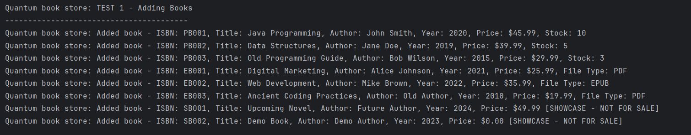
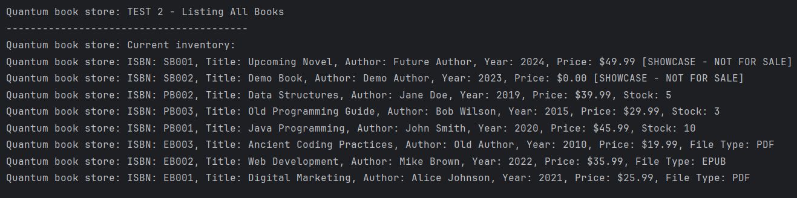
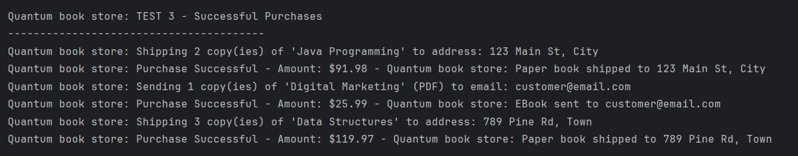
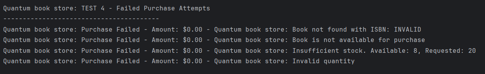
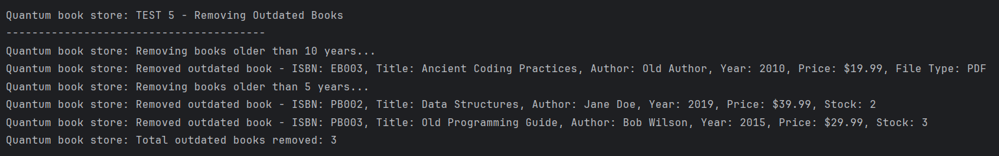
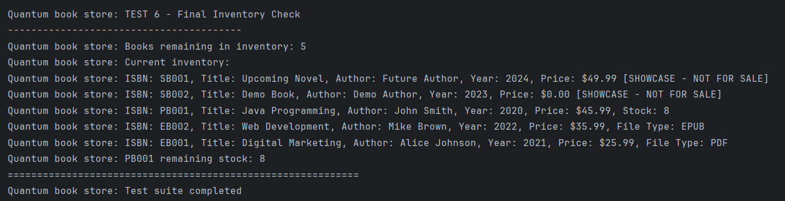

##  Architecture

### Core Classes

- **`Book`** (Abstract) - Base class for all book types
- **`PaperBook`** - Physical books with stock management
- **`EBook`** - Digital books with file type support
- **`ShowcaseBook`** - Display-only books (not purchasable)
- **`BookStore`** - Main store management system
- **`PurchaseResult`** - Encapsulates purchase transaction results

### Service Classes

- **`MailService`** - Handles email notifications for e-book purchases
- **`ShippingService`** - Manages shipping for physical book orders


##  Application Screenshots


### Test 1: Adding Books to Inventory

*Demonstration of adding various book types to the store inventory*

### Test 2: Inventory Listing

*Complete inventory display showing all available books*

### Test 3: Successful Purchases

*Examples of successful book purchases with confirmation messages*

### Test 4: Failed Purchase Attempts

*Error handling for invalid purchase attempts*

### Test 5: Outdated Book Removal

*Automatic removal of books older than specified threshold*

### Test 6: Final Inventory Check

*Final state of the inventory after all operations*

## 🧪 Test Coverage

The application includes a comprehensive test suite (`QuantumBookstoreFullTest.java`) that covers:

1. **Book Addition**: Adding different types of books to inventory
2. **Inventory Management**: Listing and tracking all books
3. **Purchase Processing**: Both successful and failed purchase scenarios
4. **Error Handling**: Invalid quantities, insufficient stock, non-existent books
5. **Maintenance Operations**: Removing outdated books
6. **Final Verification**: Confirming final inventory state

## 🔧 Code Structure

```
Task2/
├── src/
│   ├── Main.java                    # Application entry point
│   ├── Book.java                    # Abstract base class
│   ├── PaperBook.java              # Physical book implementation
│   ├── EBook.java                  # Digital book implementation
│   ├── ShowcaseBook.java           # Display-only book implementation
│   ├── BookStore.java              # Store management system
│   ├── PurchaseResult.java         # Transaction result wrapper
│   ├── MailService.java            # Email service for e-books
│   ├── ShippingService.java        # Shipping service for physical books
│   └── QuantumBookstoreFullTest.java # Comprehensive test suite
├── screenshots/                     # Application screenshots
└── README.md                       # This file
```


## 📋 Sample Output

```
Quantum book store: Welcome to the Quantum Bookstore Demo!
==================================================
Quantum book store: Starting comprehensive test suite
============================================================

Quantum book store: TEST 1 - Adding Books
----------------------------------------
Quantum book store: Added book - PaperBook{ISBN='PB001', Title='Java Programming', Author='John Smith', Year=2020, Price=$45.99, Stock=10}
Quantum book store: Added book - PaperBook{ISBN='PB002', Title='Data Structures', Author='Jane Doe', Year=2019, Price=$39.99, Stock=5}
...
```
